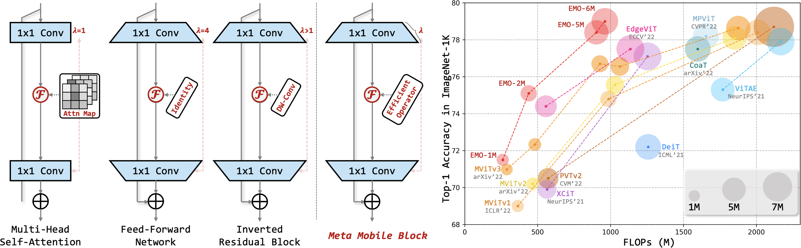

# EMO

--- 
Official [PyTorch](https://pytorch.org/) implementation of "[Rethinking Mobile Block for Efficient Attention-based Models](https://arxiv.org/abs/2301.01146)".

>**This paper is still under a review process.**

> **Abstract** This paper focuses on designing efficient models with low parameters and FLOPs for dense predictions. Even though CNN-based lightweight methods have achieved stunning results after years of research, trading-off model accuracy and constrained resources still need further improvements. This work rethinks the essential unity of efficient Inverted Residual Block in MobileNetv2 and effective Transformer in ViT, inductively abstracting a general concept of Meta-Mobile Block, and we argue that the specific instantiation is very important to model performance though sharing the same framework. Motivated by this phenomenon, we deduce a simple yet efficient modern **I**nverted **R**esidual **M**obile **B**lock (iRMB) for mobile applications, which absorbs CNN-like efficiency to model short-distance dependency and Transformer-like dynamic modeling capability to learn long-distance interactions. Furthermore, we design a ResNet-like 4-phase **E**fficient **MO**del (EMO) based only on a series of iRMBs for dense applications. Massive experiments on ImageNet-1K, COCO2017, and ADE20K benchmarks demonstrate the superiority of our EMO over state-of-the-art methods, e.g., our EMO-1M/2M/5M achieve 71.5, 75.1, and 78.4 Top-1 that surpass **SoTA** CNN-/Transformer-based models, while trading-off the model accuracy and efficiency well. Codes and models are available in the supplementary material.

<div align="center">
  
</div>

> **Left**: Abstracted unified ***Meta-Mobile Block*** from *Multi-Head Self-Attention* and *Feed-Forward Network* in Transformer as well as efficient *Inverted Residual Block* in MobileNet-v2. Absorbing the experience of light-weight CNN and Transformer, an efficient but effective ***EMO*** is designed based on deduced iRMB.<br>
> **Right**: *Performance* vs. *FLOPs* comparisons with SoTA Transformer-based methods.

------
# Main results
## Image Classification for [ImageNet-1K](https://www.image-net.org):
| Model                              | #Params | FLOPs | Resolution | Top-1 |                  Log                   |
|------------------------------------|:-------:|:-----:|:----------:|:-----:|:--------------------------------------:|
| [EMO-1M](resources/EMO_1M/net.pth) |  1.3M   | 261M  | 224 x 224  | 71.5  | [log](resources/EMO_1M/log_train.txt)  |
| [EMO-2M](resources/EMO_2M/net.pth) |  2.3M   | 439M  | 224 x 224  | 75.1  | [log](resources/EMO_2M/log_train.txt)  |
| [EMO-5M](resources/EMO_5M/net.pth) |  5.1M   | 903M  | 224 x 224  | 78.4  | [log](resources/EMO_5M/log_train.txt)  |
| [EMO-6M](resources/EMO_6M/net.pth) |  6.1M   | 961M  | 224 x 224  | 79.0  | [log](resources/EMO_6M/log_train.txt)  |

## Object Detection Performance Based on [SSDLite](https://openaccess.thecvf.com/content_ICCV_2019/papers/Howard_Searching_for_MobileNetV3_ICCV_2019_paper.pdf) for [COCO2017](https://cocodataset.org):
| Backbone |  AP  | AP<sub>50</sub> | AP<sub>75</sub> | AP<sub>S</sub> | AP<sub>M</sub> | AP<sub>L</sub> | #Params | FLOPs |                         Log                         |
|:--------:|:----:|:---------------:|:---------------:|:--------------:|:--------------:|:--------------:|:-------:|:-----:|:---------------------------------------------------:|
|  EMO-1M  | 22.0 |      37.3       |      22.0       |      2.1       |      20.6      |      43.2      |  2.3M   | 0.6G  | [log](resources/SSDLite_EMO_1M/20221030_213236.log) |
|  EMO-2M  | 25.2 |      42.0       |      25.3       |      3.3       |      25.9      |      47.6      |  3.3M   | 0.9G  | [log](resources/SSDLite_EMO_2M/20221030_213302.log) |
|  EMO-5M  | 27.9 |      45.2       |      28.1       |      5.2       |      30.2      |      50.6      |  6.0M   | 1.8G  | [log](resources/SSDLite_EMO_5M/20221027_231243.log) |

## Object Detection Performance Based on [RetinaNet](https://openaccess.thecvf.com/content_ICCV_2017/papers/Lin_Focal_Loss_for_ICCV_2017_paper.pdf) for [COCO2017](https://cocodataset.org):
| Backbone |  AP  | AP<sub>50</sub> | AP<sub>75</sub> | AP<sub>S</sub> | AP<sub>M</sub> | AP<sub>L</sub> | #Params | FLOPs |                          Log                          |
|:--------:|:----:|:---------------:|:---------------:|:--------------:|:--------------:|:--------------:|:-------:|:-----:|:-----------------------------------------------------:|
|  EMO-1M  | 34.4 |      54.2       |      36.2       |      20.2      |      37.1      |      46.0      |  10.4M  | 163G  | [log](resources/RetinaNet_EMO_1M/20221102_234131.log) |
|  EMO-2M  | 36.2 |      56.6       |      38.1       |      21.7      |      38.8      |      48.1      |  11.5M  | 167G  | [log](resources/RetinaNet_EMO_2M/20221102_220520.log) |
|  EMO-5M  | 38.9 |      59.8       |      41.0       |      23.8      |      42.2      |      51.7      |  14.4M  | 178G  | [log](resources/RetinaNet_EMO_5M/20221101_012220.log) |

## Semantic Segmentation Based on [DeepLabv3](https://arxiv.org/pdf/1706.05587.pdf) for [ADE20k](http://sceneparsing.csail.mit.edu/):
| Backbone | aAcc | mIoU | mAcc | #Params | FLOPs |                          Log                          |
|:--------:|:----:|:----:|:----:|:-------:|:-----:|:-----------------------------------------------------:|
|  EMO-1M  | 75.0 | 33.5 | 44.2 |  5.6M   | 2.4G  | [log](resources/DeepLabv3_EMO_1M/20221104_012836.log) |
|  EMO-2M  | 75.6 | 35.3 | 46.0 |  6.9M   | 3.5G  | [log](resources/DeepLabv3_EMO_2M/20221104_101732.log) |
|  EMO-5M  | 77.6 | 37.8 | 48.2 |  10.3M  | 5.8G  | [log](resources/DeepLabv3_EMO_5M/20221104_012830.log) |

## Semantic Segmentation Based on [PSPNet](https://openaccess.thecvf.com/content_cvpr_2017/papers/Zhao_Pyramid_Scene_Parsing_CVPR_2017_paper.pdf) for [ADE20k](http://sceneparsing.csail.mit.edu/):
| Backbone | aAcc | mIoU | mAcc | #Params | FLOPs |                         Log                         |
|:--------:|:----:|:----:|:----:|:-------:|:-----:|:---------------------------------------------------:|
|  EMO-1M  | 74.8 | 33.2 | 43.4 |  4.3M   | 2.1G  | [log](resources/PSPNet_EMO_1M/20221104_101711.log)  |
|  EMO-2M  | 75.5 | 34.5 | 44.9 |  5.5M   | 3.1G  | [log](resources/PSPNet_EMO_2M/20221104_101802.log)  |
|  EMO-5M  | 77.6 | 38.2 | 49.0 |  8.5M   | 5.3G  | [log](resources/PSPNet_EMO_5M/20221104_012908.log)  |

------
# Classification
## Environments
```shell
conda install -y pytorch==1.10.1 torchvision==0.11.2 torchaudio==0.10.1 cudatoolkit=11.3 -c pytorch -c conda-forge
pip3 install timm==0.6.5 tensorboardX einops torchprofile fvcore
git clone https://github.com/NVIDIA/apex && cd apex && pip3 install -v --disable-pip-version-check --no-cache-dir --global-option="--cpp_ext" --global-option="--cuda_ext" ./ (optional)
```
  
## Prepare ImageNet-1K Dataset
Download and extract [ImageNet-1K](http://image-net.org/) dataset in the following directory structure:

```
├── imagenet
    ├── train
        ├── n01440764
            ├── n01440764_10026.JPEG
            ├── ...
        ├── ...
    ├── train.txt (optional)
    ├── val
        ├── n01440764
            ├── ILSVRC2012_val_00000293.JPEG
            ├── ...
        ├── ...
    └── val.txt (optional)
```

## Test
Test with 8 GPUs in one node:

```python3 -m torch.distributed.launch --nproc_per_node=8 --nnodes=1 --use_env run.py -c configs/mobile/cls_emo -m test model.name=EMO_1M trainer.data.batch_size=2048 model.model_kwargs.checkpoint_path=resources/EMO-1M/net.pth```

This should give `Top-1: 71.498 (Top-5: 90.368)` 

<details>
<summary>
EMO-2M
</summary>

```
python3 -m torch.distributed.launch --nproc_per_node=8 --nnodes=1 --use_env run.py -c configs/mobile/cls_emo -m test model.name=EMO_2M trainer.data.batch_size=2048 model.model_kwargs.checkpoint_path=resources/EMO-2M/net.pth
```
This should give `Top-1 75.134 (Top-5: 92.184)` 
</details>


<details>
<summary>
EMO-5M
</summary>

```
python3 -m torch.distributed.launch --nproc_per_node=8 --nnodes=1 --use_env run.py -c configs/mobile/cls_emo -m test model.name=EMO_5M trainer.data.batch_size=2048 model.model_kwargs.checkpoint_path=resources/EMO-5M/net.pth
```
This should give `Top-1 78.422 (Top-5: 93.970)` 
</details>


<details>
<summary>
EMO-6M
</summary>

```
python3 -m torch.distributed.launch --nproc_per_node=8 --nnodes=1 --use_env run.py -c configs/mobile/cls_emo -m test model.name=EMO_6M trainer.data.batch_size=2048 model.model_kwargs.checkpoint_path=resources/EMO-6M/net.pth
```
This should give `Top-1 78.988 (Top-5: 94.162)` 
</details>


## Train
Train with 8 GPUs in one node: 

```python3 -m torch.distributed.launch --nproc_per_node=8 --nnodes=1 --use_env run.py -c configs/mobile/cls_emo -m train model.name=EMO_1M trainer.data.batch_size=2048```

------
# Down-Stream Tasks
## Object Detection
- Ref to [MMDetection](https://github.com/open-mmlab/mmdetection) for the environments.
- Configs can be found in `down-stream-tasks/mmdetection/configs/ssd_emo` and `down-stream-tasks/mmdetection/configs/retinanet_emo`
- *E.g.*:<br>
`./tools/dist_train.sh configs/ssd_emo/ssdlite_emo_5M_pretrain_coco.py $GPU_NUM`  # for SSDLite with EMO-5M<br>
`./tools/dist_train.sh configs/retinanet_emo/retinanet_emo_5M_fpn_1x_coco.py $GPU_NUM`  # for RetinaNet with EMO-5M

## Semantic Segmentation
- Ref to [MMSegmentation](https://github.com/open-mmlab/mmsegmentation) for the environments.
- Configs can be found in `down-stream-tasks/mmsegmentation/configs/deeplabv3_emo` and `down-stream-tasks/mmsegmentation/configs/pspnet_emo`
- *E.g.*:<br>
`./tools/dist_train.sh configs/deeplabv3_emo/deeplabv3_emo_5M_pretrain_512x512_80k_ade20k.py $GPU_NUM`  # for DeepLabv3 with EMO-5M<br>
`./tools/dist_train.sh configs/pspnet_emo/pspnet_emo_5M_512x512_80k_ade20k.py $GPU_NUM`  # for PSPNet with EMO-5M

## Mobile Evaluation
- run `python3 model/_emo_ios.py` to obtain Core ML models
- Ref to [Classifying Images with Vision and Core ML](https://developer.apple.com/documentation/vision/classifying_images_with_vision_and_core_ml) to build IOS App and test.

# Acknowledgements
We thank but not limited to following repositories for providing assistance for our research:
- [TIMM](https://github.com/rwightman/pytorch-image-models)
- [MMDetection](https://github.com/open-mmlab/mmdetection)
- [MMSegmentation](https://github.com/open-mmlab/mmsegmentation)
